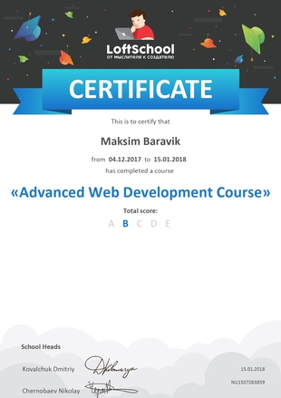

# Maxim Borovik

## Contacts: 

**Phone:** +375 29 122 09 55

**E-mail:** maxim.bma10@gmail.com

[GitHub](https://github.com/borovikm)

[LinkedIn](https://www.linkedin.com/in/maxim-borovik-4081ba113/)

## About

I am always keen in self-development and improvement. I’m communicable, loyal and flexible. I have an analytical mind and i am a hard worker. Self-driven, responsible and committed. I`m quick learner and able to adapt. 

I have more than 10 years of experience as chief accountant.

## Education

International Humanitarian and Economic Institute

Minsk State College of Light Industry Enterprise

## Skills

* HTML 
* CSS (SASS/SCSS)
* JavaScript
* Git
* Gulp
* BEM
* Photoshop, Figma, Zeplin

## Code example

``` 
function noSpace(x){
  return x.replace(/\s+/g, '');
} 
```

## Courses

* [Loftscool.com](https://loftschool.com/) Course: Profession: Web-Developer 

||                    
 
## Languages

*Russian* - native speaker

*English* - A2+. **I lived and worked in Dubai for 2 years.**